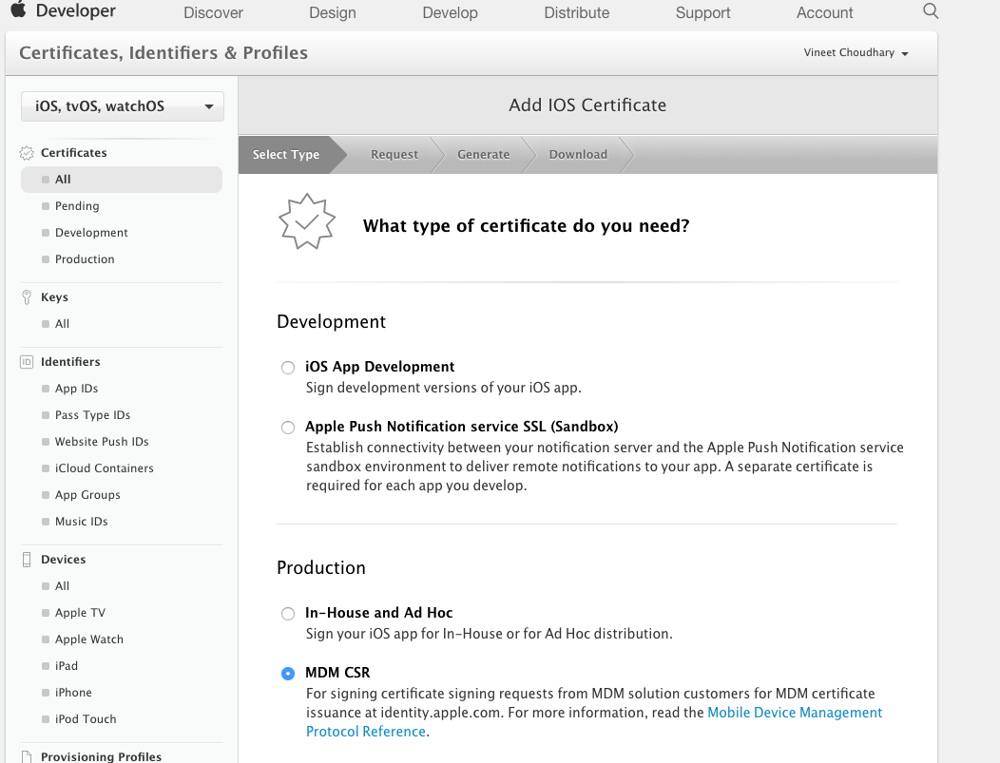
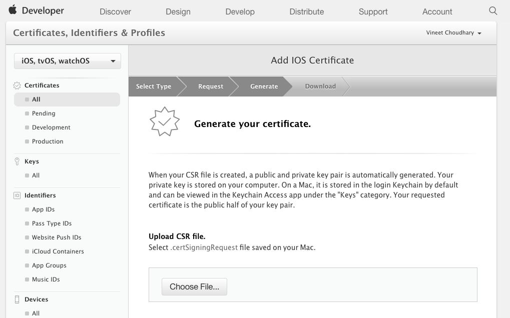
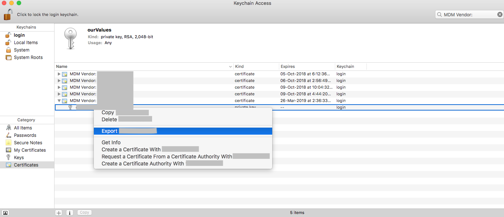
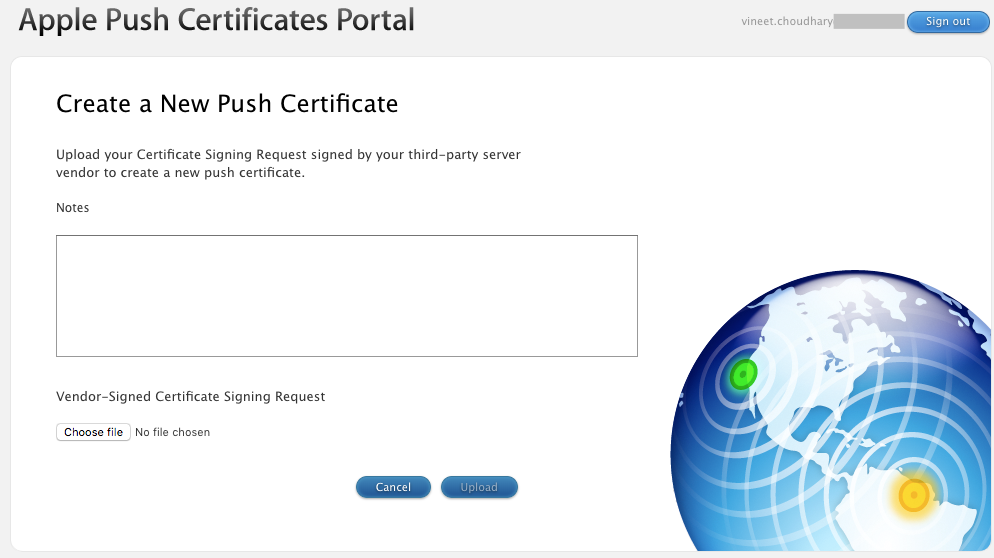
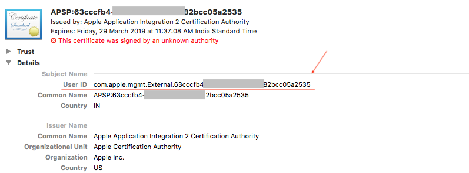
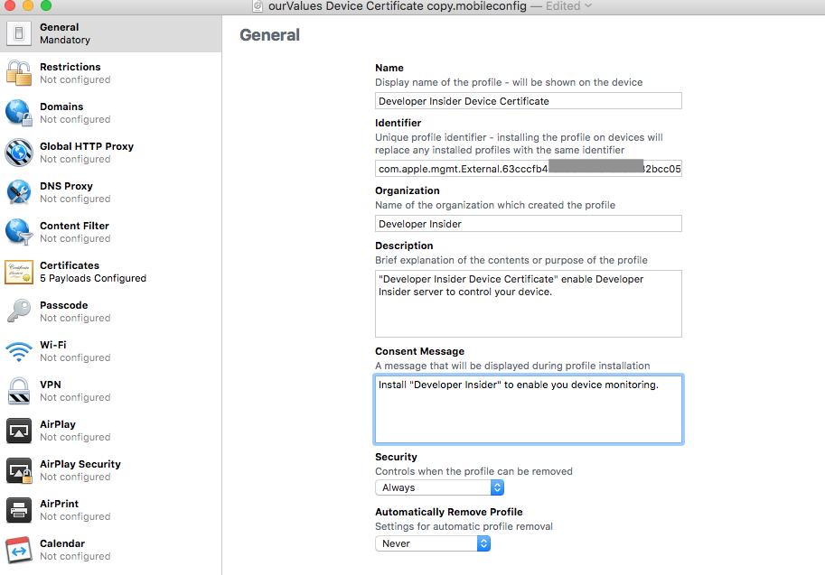

# Overview[]()

Instructions and code for setting up a simple iOS Mobile Device Management (MDM) server.  MDM allows for OS level control of multiple devices from a centralized location.  A remote administrator can install/remove apps, install/revoke certificates, lock the device, change password requirements, etc.  

# Prerequisites

 * Publicly accessible Linux/Unix server
 * Apple Enterprise Account
 * Apple Developer Account
 * Python 2.7 (See Server Setup for libraries)
 * openssl command-line
 * Java SDK (java/javac)

# Setup

 1. Create MDM Vendor CSR
    * Open Keychain Access.
    * Go to the menu bar: Keychain Access -> Certificate Assistant -> Request a Certificate From a Certificate Authority.
    * Use the same email as the developer account that will be used.  Enter in a common name as well.
    * Select *Saved to disk*.  
    
    ---
    
    ---
    
    **Note** - Save all file in same directory (let's say MDM).

 2. Upload CSR to Apple
    * Go to [Apple's Certificates, Identifiers & Profiles page](https://developer.apple.com/account/ios/certificate/certificateCreate.action).
    * Select the option to add a new certificate
    * Select MDM CSR under Production.  If this option is disabled, you will need to contact apple to enable it.  You can either email apple at devprograms@apple.com or go through the [online contact menu](http://developer.apple.com/contact/).  In your message, indicate that you are looking to create an MDM Vendor Certificate and need the MDM CSR option enabled on the certificate creation page.  Apple should respond within one business day according to their contact page.  
    
    ---
    
    ---
    
    * When you have the MDM CSR option available, select it and hit continue.  Hit continue again through Apple's description of how to create a CSR file (we already have one).
    * Upload the .certSigningRequest file we created in step 1 and then hit generate.  A .cer file should be downloaded. Name it something like `mdmvendor.cer`.
    
    ---
    
    ---

 3. Export MDM private key
    * Open your `mdmvendor.cer` file in Keychain Access.
    * Select Certificates from the left side.
    * You should find your certificate listed as *MDM Vendor: Common Name*.
    * There should be an arrow on that line that opens up show the MDM private key.
    * Right-click the private key, select *Export...*, and save as `private.p12`
    
    ---
    
    ---
    
    * Remember where you save this file, we will use it in step 5.

 4. Create Push Certificate CSR
    * In Keychain Access, again select from the menu bar: Keychain Access -> Certificate Assistant -> Request a Certificate From a Certificate Authority.
    * Enter your email (can be a different email) and a common name.
    * Select *Saved to disk* and name it something like `push.csr`.
    
    ---
    
    ---

 5. Extract MDM private key and MDM Vendor Certificate
    * Open terminal and change the directory to the MDM directory, which you created in Step 1. Also, make sure at this stage that the MDM directory contains the following 4 files -
 
    ---
    
    ---

    * **Extract private key using the following command:**
    If you've added a password to `private.p12` file during export in step 3 you need to enter the same import password in this command. Also you need to enter the PEM pass phrase. This pass phrase will be requires in next command.

    `openssl pkcs12 -in private.p12 -nocerts -out key.pem`

    * **Strip the password from the private key using the following command:**
    This command will ask you to enter pass the phrase for `key.pem`, here you need to enter same pass phrase which you entered in last command.

    `openssl rsa -in key.pem -out private.key`

    * **Extract certificate using the following command:**
    Again, if you've added any password in `private.p12` file during export in step 3 you need to enter same import password in this command.

    `openssl pkcs12 -in private.p12 -clcerts -nokeys -out cert.pem`

    * **Convert certificate to DES using the following command:**

    `openssl x509 -in cert.pem -inform PEM -out mdm.cer -outform DES`

    * In this step you've created 4 files `key.pem`, `private.key`, `cert.pem` and `mdm.cer`. These files will be used in the next step. After this step you MDM directory will look like this -
    
    ---
    
    ---
    
 6. Use the mdmvendorsign tool to create `applepush.csr`
    * We're going to use the python code located in `/vendor/`.  If `/vendor/` is currently empty, you probably forgot to init and update submodules

    `git submodule init`
    `git submodule update`
    
    * Copy `private.key`, `push.csr`, and `mdm.cer` into `/vendor/`

    * Run the following command while in that directory:

    `python mdm_vendor_sign.py --key private.key --csr push.csr --mdm mdm.cer --out applepush.csr`

    * This should generate `applepush.csr`.

 7. Get Push Certificate from Apple
    * Go to [Apple's Push Certificates Portal](https://identity.apple.com/pushcert/) and click the Create a Certificate button.
    
    ---
    
    ---
    
    * Upload `applepush.csr` to create a new entry in the table.
    * Download the resulting push certificate.
    
    ---
    
    ---
    
    * Open the push certificate in Keychain Access.

 8. Prepare Push Certificate
    * Find the push certificate in Keychain Access.  It should look like `*APSP:hexstuffhere*`.
    * Right-click the certificate and select *Get Info*.
    * Copy down the User ID which should look like `com.apple.mgmt.External.hexstuffhere...`  We will use it later on in step 9.
    
    ---
    
    ---
    
    * Right-click the certificate and select *Export...* and save it as `mdm.p12`
    
    ---
    
    ---
    
    * Run the following command to convert it to a pem file. Again, if you've added any password in `mdm.p12` file during export you need to enter same import password in this command:

    `openssl pkcs12 -in mdm.p12 -out PushCert.pem -nodes`

    * Move the resulting `PushCert.pem` file to `/server/`.

 9. Generate additional certs
    * Go to the scripts directory and run `make_certs.sh`.
    * This will generate a number of necessary certs to move forward.
    * Certs will be automatically moved to their proper location in `/server`.
    * We'll use `identity.p12` in step 10 to create an `Enroll.mobileconfig` file

10. Create Enroll.mobileconfig
    * Open the [Apple Configurator 2](https://itunes.apple.com/in/app/apple-configurator-2/id1037126344?mt=12), click File option in menu bar, and then click the New Profile.
    * In the General category, pick a name to identify the cert. For Identifier, use the `com.apple.mgmt.External.hexstuffhere` that you copied down in step 8.
    * In the Certificates category, click configure and find your `scripts/identity.p12` file generated in step 9. For password, we either use the PEM password or the export password.
    
    ---
    
    ---
    
    * Now, save this mobile configuration as `Enroll.mobileconfig`.
    
11. Config Mobile Device Management
    * For Mobile Device Management, Open `Enroll.mobileconfig` file in any text editor. Your `Enroll.mobileconfig` file looks like this -
    
   ``` 
<?xml version="1.0" encoding="UTF-8"?>
<!DOCTYPE plist PUBLIC "-//Apple//DTD PLIST 1.0//EN" "http://www.apple.com/DTDs/PropertyList-1.0.dtd">
<plist version="1.0">
<dict>
    <key>ConsentText</key>
    <dict>
        <key>default</key>
        <string>Install "Developer Insider" to enable you device monitoring.</string>
    </dict>
    <key>PayloadContent</key>
    <array>
        <dict>
            <key>Password</key>
            <string>test@123</string>
            <key>PayloadCertificateFileName</key>
            <string>identity.p12</string>
            <key>PayloadContent</key>
            <data>
            MIIeyQIBAzCCHo8GCSqGSIb3DQEHAaCCHoAEgh58MIIeeDCCGS8G
            CSqGSIb3DQEHBqCCGSAwghk.............................
            ....................DAyJB5BmDPMECJpm+FuDUe5tAgIIAA==
            </data>
            <key>PayloadDescription</key>
            <string>Adds a PKCS#12-formatted certificate</string>
            <key>PayloadDisplayName</key>
            <string>identity.p12</string>
            <key>PayloadIdentifier</key>
            <string>com.apple.security.pkcs12.38236F74-XXXX-XXXX-XXXX-5C4923A303FA</string>
            <key>PayloadType</key>
            <string>com.apple.security.pkcs12</string>
            <key>PayloadUUID</key>
            <string>38236F74-XXXX-XXXX-XXXX-5C4923A303FA</string>
            <key>PayloadVersion</key>
            <integer>1</integer>
        </dict>
    </array>
    <key>PayloadDescription</key>
    <string>"Developer Insider Device Certificate" enable Developer Insider server to control your device.</string>
    <key>PayloadDisplayName</key>
    <string>Developer Insider Device Certificate</string>
    <key>PayloadIdentifier</key>
    <string>com.apple.mgmt.External.63cccfb4-XXXX-XXXX-XXXX-82bcc05a2535</string>
    <key>PayloadOrganization</key>
    <string>Developer Insider</string>
    <key>PayloadRemovalDisallowed</key>
    <false/>
    <key>PayloadType</key>
    <string>Configuration</string>
    <key>PayloadUUID</key>
    <string>0CF6836A-XXXX-XXXX-XXXX-12B61C878FB4</string>
    <key>PayloadVersion</key>
    <integer>1</integer>
</dict>
</plist>
    
   ```
   * Now we need to add following MDM options dictionary into `PayloadContent` array of `Enroll.mobileconfig`.
   
   ```
   <dict>
    <key>AccessRights</key>
    <integer>4096</integer>
    <key>CheckInURL</key>
    <string>https://YOUR_HOSTNAME_OR_IP:8080/checkin</string>
    <key>CheckOutWhenRemoved</key>
    <true/>
    <key>IdentityCertificateUUID</key>
    <string>38236F74-XXXX-XXXX-XXXX-5C4923A303FA</string>
    <key>PayloadDescription</key>
    <string>Configures MobileDeviceManagement.</string>
    <key>PayloadIdentifier</key>
    <string>com.apple.mdm.34995C2E-XXXX-XXXX-XXXX-D6DB637A1D6E</string>
    <key>PayloadOrganization</key>
    <string>Developer Insider</string>
    <key>PayloadType</key>
    <string>com.apple.mdm</string>
    <key>PayloadUUID</key>
    <string>34995C2E-XXXX-XXXX-XXXX-D6DB637A1D6E</string>
    <key>PayloadVersion</key>
    <integer>1</integer>
    <key>ServerURL</key>
    <string>https://YOUR_HOSTNAME_OR_IP:8080/server</string>
    <key>SignMessage</key>
    <true/>
    <key>Topic</key>
    <string>com.apple.mgmt.External.63cccfb4-XXXX-XXXX-XXXX-82bcc05a2535</string>
    <key>UseDevelopmentAPNS</key>
    <false/>
</dict>
   ```
   
   * **Structure of MDM Payloads**
   The Mobile Device Management (MDM) payload, a simple property list, is designated by the `com.apple.mdm` value in the `PayloadType` field. This payload defines the following keys specific to MDM payloads:
   
   Key | Type | Description
   --- | --- | ---
   IdentityCertificateUUID | String | *Mandatory*. UUID of the certificate payload for the device’s identity. It may also point to a SCEP payload. You need to use the `PayloadUUID` of the `identity.p12` in this field.
   PayloadUUID | String | *Mandatory*. Here you need to generate a UUID. You can use `uuidgen` to generate an UUID and then copy paste that UUID in this field. UUID looks like this 34995C2E-XXXX-XXXX-XXXX-D6DB637A1D6E
   PayloadIdentifier | String | Here you need to append the UUID in after `com.apple.mgmt.External` which we generated earlier. Your payload identifier looks like this `com.apple.mgmt.External.1d24XXX-XXXX-XXXX-XXXX-XXXXXXXXe4b3.34995C2E-XXXX-XXXX-XXXX-D6DB637A1D6E`
   Topic | String | *Mandatory*. The topic that MDM listens to for push notifications. The certificate that the server uses to send push notifications must have the same topic in its subject. The topic must begin with the `com.apple.mgmt.External.hexstuffhere...` prefix.
   ServerURL | String | *Mandatory*. The URL that the device contacts to retrieve device management instructions. Must begin with the `https://` URL scheme, and may contain a port number (`https://YOUR_HOSTNAME_OR_IP:PORT/server`, for example).
   CheckInURL | String | *Optional*. The URL that the device should use to check in during installation. Must begin with the `https://` URL scheme and may contain a port number (`https://YOUR_HOSTNAME_OR_IP:8080/checkin`, for example). If this URL is not given, the `ServerURL` is used for both purposes.
   CheckOutWhenRemoved | Boolean | *Optional*. If `true`, the device attempts to send a `CheckOut` message to the check-in server when the profile is removed. Defaults to `false`.
   AccessRights | Integer, flags | Required. Logical OR of the following bit-flags:<br> 1: Allow inspection of installed configuration profiles.<br> 2: Allow installation and removal of configuration profiles.<br> 4: Allow device lock and passcode removal.<br> 8: Allow device erase.<br> 16: Allow query of Device Information (device capacity, serial number).<br> 32: Allow query of Network Information (phone/SIM numbers, MAC addresses).<br> 64: Allow inspection of installed provisioning profiles.<br> 128: Allow installation and removal of provisioning profiles.<br> 256: Allow inspection of installed applications.<br> 512: Allow restriction-related queries.<br> 1024: Allow security-related queries.<br> 2048: Allow manipulation of settings.<br> 4096: Allow app management.<br><br>May not be zero. If 2 is specified, 1 must also be specified. If 128 is specified, 64 must also be specified.
   UseDevelopmentAPNS | Boolean | *Optional*. If `true`, the device uses the development APNS servers. Otherwise, the device uses the production servers. Defaults to `false`. Note that this property must be set to false if your Apple Push Notification Service certificate was issued by the Apple Push Certificate Portal. That portal only issues certificates for the production push environment.
   
   * Now save the file as `Enroll.mobileconfig` and move it to the `/server` directory.
    
12. Cleanup
    * Any additional files that are not in /server/ generated during this process are not necessary for running the server.  Some of them may have/be private keys or other unique information, so it is probably a good idea to protect or destroy those files.
    * Most certs will be located in the /scripts/ folder.  There may be some generated from Keychain Access that were saved by the user and may be saved elsewhere.
    * Please secure these files and prevent others from being able to access them.
    
    **References**
    * [developerinsider.co - How to create a verified iOS Mobile Device Management(MDM) profile?](https://developerinsider.co/how-to-create-a-verified-ios-mobile-device-management-mdm-profile/)

# Server Setup

The server code is based on and heavily takes from [Intrepidus Group's blackhat presentation](https://intrepidusgroup.com/).  Copy over the **mdm-server/server** directory you put the enrollment profile and certificates in to your server.

You must have the following installed on the server:
  * Openssl
    * Recommend downloading and compiling yourself
    * Some Debian-based distros disable features needed by M2Crypto
    * Source available at [http://www.openssl.org/source/](http://www.openssl.org/source/)
  * Python 2.7, with the following libraries
     * [web.py](http://webpy.org/)
     * [M2Crypto](https://pypi.python.org/pypi/M2Crypto)
     * [PyOpenSSL](https://pypi.python.org/pypi/pyOpenSSL)
     * [APNSWrapper](https://pypi.python.org/pypi/APNSWrapper)
       * APNSWrapper appears to be inactive
       * On 22 October 2014, [Apple removed support for SSLv3](https://developer.apple.com/news/?id=10222014a), which APNSWrapper uses, due to the poodle vulnerability
       * As a temporary solution, users need to edit line 131 of connections.py of the source code of APNSWrapper
       * Change "SSLv3" to "TLSv1", so that the line reads:
       ```python
         ssl_version = self.ssl_module.PROTOCOL_TLSv1,
       ```
       * After making the change, users should install the library using:

       ```bash
         python setup.py install
       ```
       
       * More information will follow as we find a better solution

Network Settings
  * Outbound access to gateway.push.apple.com:2195
  * Inbound access to port 8080
  * iOS device must also have outbound access to gateway.push.apple.com:5223

If everything is setup appropriately, simply navigate to the **/server** directory and run <code>python server.py</code>.

On the device navigate to: **https://YOUR_HOST:8080/**
Once there you need to, in order: 
 1. Tap *here* to install the CA Cert (for Server/Identity)
 2. Tap *here* to enroll in MDM (the device should appear after this step) 
 3. Select Command (DeviceLock is a good one to test) and check your device.  Click Submit to send the command.
 4. If everything works, the device should lock and you're good to go!  As of right now some of the commands aren't fully implemented.  Feel free to experiment with different commands!

---

---

You can now run those commands from any web browser, a successfull command will often looks something like the following:

---

---

Click the "Response" button to see the plist response from apple.  Click the pencil to edit the device name, device owner, and device location.


When stopping the server, the standard control-c doesn't usually work.  Instead use control-z to suspend the process and then use a kill command to end the process.

    ^z
    [1]+  Stopped                 python server.py
    user:~/mdm-server/server$ kill %1
    [1]+  Terminated              python server.py
    user:~/mdm-server/server$ 

The server uses the pickle library to save devices.  When the device class is updated, the pickle format may be invalidated, causing the server to error.  In order to fix this, remove the devicelist.pickle file (make a backup just in case!) and re-enroll all devices.

# Client Reporting

The MDM server also has REST endpoints for reporting issues and geolocation data from the enrolled clients.  This functionality may be used at a later point in time by a security app. The API can be imported into any project as follows:

* Click on the top level Project item and add files ("option-command-a")
* Navigate to client-reporting/
* Highlight the client-reporting subdirectory
* Click the Add button

The library provides the following functions:

    +(void) setHostAddress: (NSString*) host; // Set where the MDM server lives
    +(void) setPause : (BOOL) toggle; // Toggle whether to add a thread execution pause to allow requests to finish
    +(void) reportJailbreak;  // Report that the device has been jailbroken
    +(void) reportDebugger; // Report that the application has a debugger attached
    +(void) reportLocation : (CLLocationCoordinate2D*) coords; // Report the lat/lon location of the device
    
"setHostAddress" and "setPause" are meant to be set once only, and effect all "report" calls.  An example usage may look like:

    // Code in application init
    [client_reporting setHostAddress:@"192.168.0.0"];
    [client_reporting setPause:YES];
    
    // Later code during execution
    [client_reporting reportDebugger]

This client API can be coupled with the [iMAS security-check controls](git@github.com:project-imas/security-check.git) to provide accurate reporting of jailbreak and debugger detection.  


Apologies for the long and complex setup, we hope to eventually make things easier and simpler.  Please post questions to github if you get stuck and we'll do our best to help.  Enjoy!


# LICENSE AND ATTRIBUTION

Copyright 2013-2014 The MITRE Corporation, All Rights Reserved.

Licensed under the Apache License, Version 2.0 (the "License"); you may not use this work except in compliance with the License. You may obtain a copy of the License at

    http://www.apache.org/licenses/LICENSE-2.0

Unless required by applicable law or agreed to in writing, software distributed under the License is distributed on an "AS IS" BASIS, WITHOUT WARRANTIES OR CONDITIONS OF ANY KIND, either express or implied. See the License for the specific language governing permissions and limitations under the License.


This project also uses code from various sources under various licenses.

[The original code from the Intrepidus Group's python server is under the BSD License found here.](server/LICENSE)

[The python vendor signing code is located here and is under the MIT license.](https://github.com/grinich/mdmvendorsign)

[The Softhinker certificate signing code is under the Apache License found here.](vendor-signing/LICENSE)

[The website's Bootstrap code is under the MIT License found here.](server/static/dist/LICENSE)

The certificate setup instructions were based on [this blog post](http://www.blueboxmoon.com/wordpress/?p=877).  Our thanks to Daniel.

Finally we use some free [glyphicons](http://glyphicons.com/) that are included with bootstrap.
